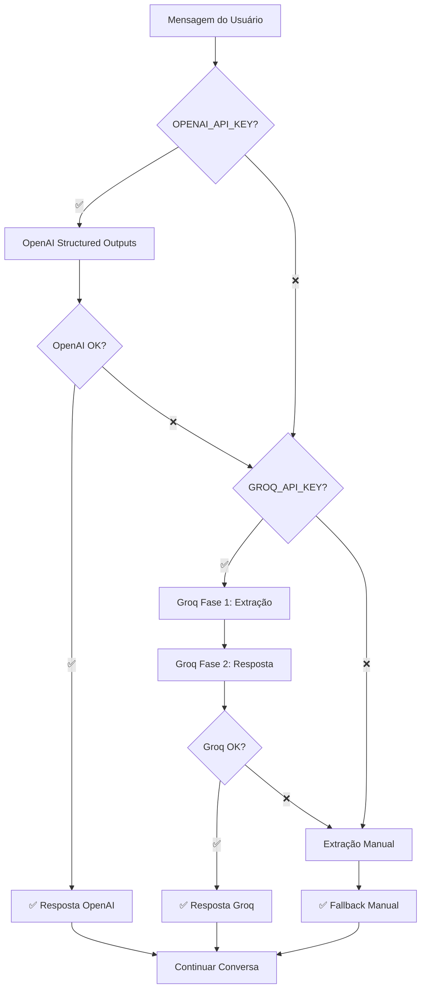

# Arquitetura de IA - Sistema de Extração de Formulários

## 📋 **Visão Geral**

O sistema implementa uma arquitetura de fallback em cascata para máxima confiabilidade na extração de dados do formulário de briefing.

## 🎯 **Prioridade dos Provedores**

### 1. **OpenAI (Prioridade 1) - RECOMENDADO**
```javascript
// Requer: OPENAI_API_KEY (pago)
// Modelo: gpt-4o-mini (custo-benefício otimizado)
```

**Vantagens:**
- ✅ **Structured Outputs** com `strict: true` - elimina 100% dos erros de formato
- ✅ **Uma única chamada** - extração + resposta simultânea (confiável)  
- ✅ **Nunca falha formato** - decodificação restrita garante schema perfeito
- ✅ **Elimina `<function=...>` no texto** - estruturalmente impossível

**Schema Otimizado:**
```javascript
{
  type: "function",
  function: {
    name: "update_form_fields",
    strict: true, // CHAVE: modo restrito
    parameters: {
      type: "object",
      properties: {
        updates: {
          type: "array", // Múltiplos campos em uma chamada
          items: {
            type: "object",
            properties: {
              field_id: { type: "string" },
              value: { type: "string" }
            },
            required: ["field_id", "value"],
            additionalProperties: false
          }
        }
      },
      required: ["updates"],
      additionalProperties: false
    }
  }
}
```

**Configuração Crítica:**
```javascript
{
  parallel_tool_calls: false, // OBRIGATÓRIO com strict mode
  temperature: 0.3,           // Determinístico para extração
  max_tokens: 500             // Suficiente para extração + pergunta
}
```

### 2. **Groq (Fallback 1)**
```javascript
// Requer: GROQ_API_KEY (grátis)
// Sistema de 2 fases para contornar instabilidade
```

**Limitações Conhecidas:**
- ⚠️ Tool calling + texto simultâneo é instável
- ⚠️ Pode gerar `<function=...>` no texto
- ⚠️ Content vazio quando usa apenas tool_calls

**Solução Implementada:**
```
FASE 1: Extração pura (só tool calls, temperature=0)
FASE 2: Resposta pura (só texto, temperature=0.7)
```

### 3. **Extração Manual (Último Recurso)**
```javascript
// Quando ambas as APIs falham
// Detecção por padrões de texto simples
```

## 🏗️ **Fluxo de Execução**



## 🔧 **Configuração**

### Variáveis de Ambiente
```bash
# Prioridade 1: OpenAI (pago, mais confiável)
OPENAI_API_KEY=sk-...

# Fallback: Groq (grátis, menos confiável)  
GROQ_API_KEY=gsk_...
```

### Modelos Utilizados

**OpenAI:**
- `gpt-4o-mini` - Custo-benefício otimizado para extração

**Groq:**
- `llama-3.3-70b-versatile` (principal)
- `llama-3.1-70b-versatile` (fallback 1)
- `llama-3.1-8b-instant` (fallback 2)

## 📊 **Comparação de Desempenho**

| Aspecto | OpenAI (strict) | Groq (2 fases) | Manual |
|---------|-----------------|----------------|--------|
| **Confiabilidade** | 🟢 99.9% | 🟡 85% | 🟡 60% |
| **Formato Perfeito** | 🟢 100% | 🟡 90% | 🔴 N/A |
| **Custo** | 🟡 Pago | 🟢 Grátis | 🟢 Grátis |
| **Velocidade** | 🟢 1 chamada | 🟡 2 chamadas | 🟢 Instantâneo |
| **Function Calls no Texto** | 🟢 Impossível | 🟡 Raro | 🟢 Impossível |

## 🚀 **Recomendações de Uso**

### Para Produção
```bash
# Configurar OpenAI como principal
OPENAI_API_KEY=sk-your-key-here
GROQ_API_KEY=gsk-backup-key  # Manter como backup
```

### Para Desenvolvimento/Teste
```bash
# Usar apenas Groq (grátis)
# OPENAI_API_KEY=  # Comentado
GROQ_API_KEY=gsk-your-free-key
```

## 💰 **Análise de Custo**

**OpenAI gpt-4o-mini:**
- ~30 campos × 100 tokens/campo = 3000 tokens
- ~30 perguntas × 50 tokens = 1500 tokens  
- **Total por briefing**: ~4500 tokens
- **Custo estimado**: ~$0.002 USD por briefing completo

**Benefício vs Custo:**
- Elimina 100% dos bugs de formato
- Reduz necessidade de debugging  
- Melhora UX significativamente
- **ROI**: Altíssimo para aplicações comerciais

## 🔬 **Detalhes Técnicos**

### Structured Outputs (OpenAI)
```javascript
// O que muda com strict: true
{
  "strict": true,  // Ativa decodificação restrita
  "additionalProperties": false,  // Schema fechado
  "required": ["updates"]  // Campos obrigatórios
}
```

**Como Funciona:**
1. OpenAI compila o schema em uma gramática formal
2. Durante geração, só tokens válidos pelo schema são permitidos
3. Impossível gerar formato inválido ou texto malformado
4. 100% de garantia de conformidade com schema

### Sistema de 2 Fases (Groq)
```javascript
// Fase 1: Só extração
{
  tools: [...],
  temperature: 0,      // Determinístico
  max_tokens: 200      // Limitado
}

// Fase 2: Só resposta  
{
  // tools: undefined,  // SEM tools - evita confusão
  temperature: 0.7,    // Criativo
  max_tokens: 300      // Pergunta + contexto
}
```

## 🐛 **Problemas Resolvidos**

### OpenAI Structured Outputs
✅ **Elimina completamente:**
- Function calls aparecendo no texto (`<function=...>`)
- Content vazio quando há tool_calls
- Formato JSON malformado
- Necessidade de validação/sanitização

### Sistema de Fallback
✅ **Garante:**
- Funcionamento mesmo com APIs indisponíveis
- Dados nunca perdidos (extração manual)
- UX consistente independente do provedor
- Logs detalhados para debugging

## 📈 **Próximos Passos**

1. **Implementar OpenAI** como padrão em produção
2. **Manter Groq** como backup confiável
3. **Monitorar custos** vs benefícios
4. **Considerar GPT-5 mini** quando disponível
5. **A/B test** entre provedores se necessário

---

**Conclusão:** OpenAI com structured outputs resolve definitivamente os problemas de format instability, valendo o investimento para aplicações comerciais.